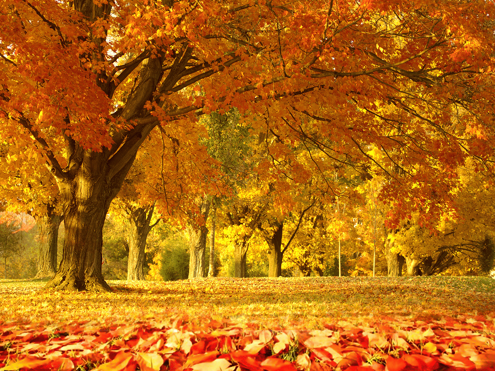
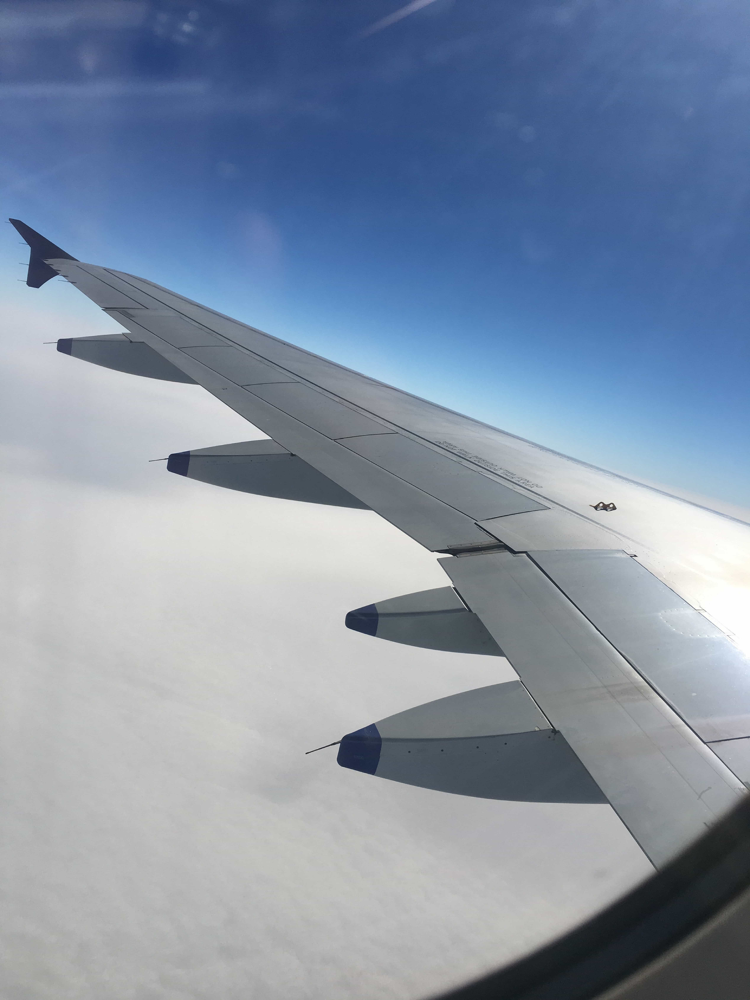

# 图像压缩结果对比

## PNG 压缩结果展示

| 质量等级 | 图片预览 | 文件大小 | 压缩率 | 说明 |
|---------|---------|----------|--------|------|
| **原始图片** |  | 5.01MB | - | 原始PNG文件 |
| **质量30** |  | 1.68MB | **66.4%** | 最大压缩，颜色量化明显 |
| **质量50** |  | 1.98MB | **60.4%** | 平衡压缩比和质量 |
| **质量70** |  | 2.02MB | **59.7%** | 较好质量，适中压缩 |
| **质量90** |  | 2.32MB | **53.7%** | 高质量，温和压缩 |

## JPEG 压缩结果展示

| 质量等级 | 图片预览 | 文件大小 | 压缩率 | 说明 |
|---------|---------|----------|--------|------|
| **原始图片** |  | 5.02MB | - | 原始JPEG文件 |
| **质量30** |  | 229.50KB | **95.5%** | 极高压缩，适合缩略图 |
| **质量50** |  | 389.35KB | **92.4%** | 高压缩，网页优化 |
| **质量70** |  | 745.89KB | **85.5%** | 良好质量，标准压缩 |
| **质量90** |  | 2.58MB | **48.7%** | 高质量，温和压缩 |

## 压缩效果分析

### PNG压缩特点
- 🎨 **颜色量化技术**: 将24位真彩色转换为8位索引色彩
- 📊 **无损压缩**: 在量化后进行无损压缩存储
- 🎯 **适用场景**: 图标、截图、简单图形

### JPEG压缩特点  
- 🖼️ **有损压缩**: 基于DCT变换的高效压缩
- 📱 **广泛兼容**: 所有平台和浏览器支持
- 🌟 **适用场景**: 照片、复杂图像

### 性能对比

| 指标 | PNG压缩 | JPEG压缩 | 备注 |
|------|---------|-----------|------|
| 最大压缩率 | 66.4% | 95.5% | JPEG压缩效果更佳 |
| 处理时间 | ~13秒 | ~15秒 | 性能相近 |
| 质量保持 | 优秀 | 优秀 | 都支持高质量模式 |
| 适用图片 | 简单图形 | 复杂照片 | 各有优势 |

---

*测试环境: 5MB测试图片，Rust fast-image库*
